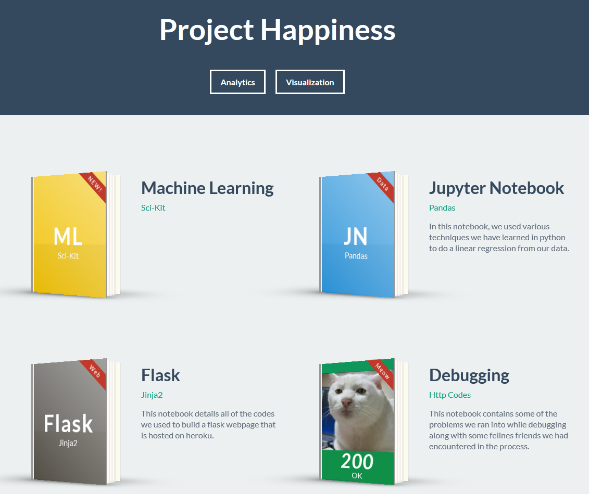
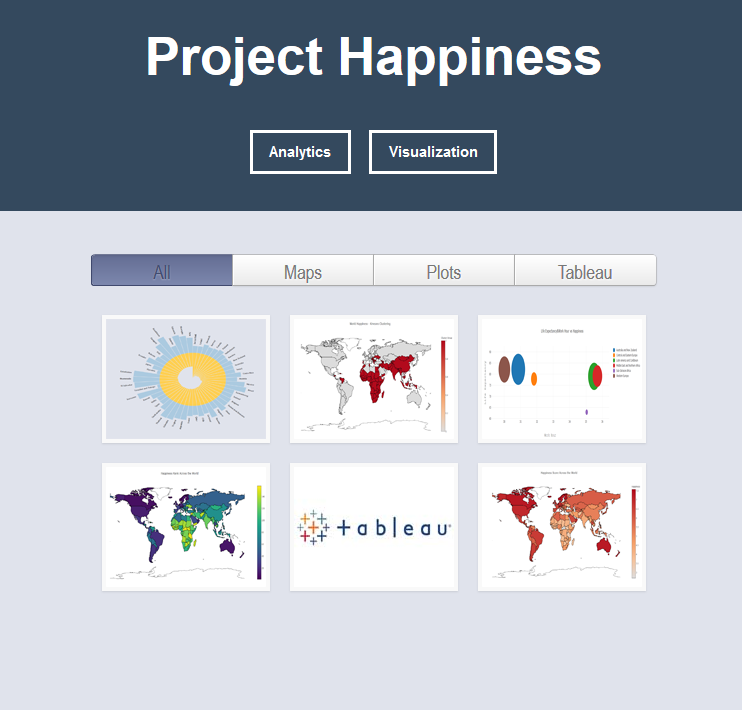
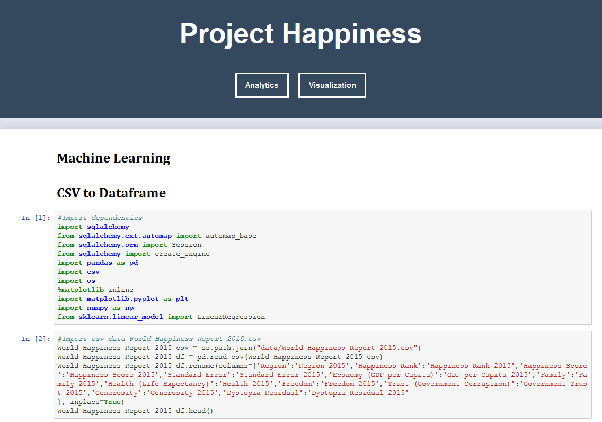
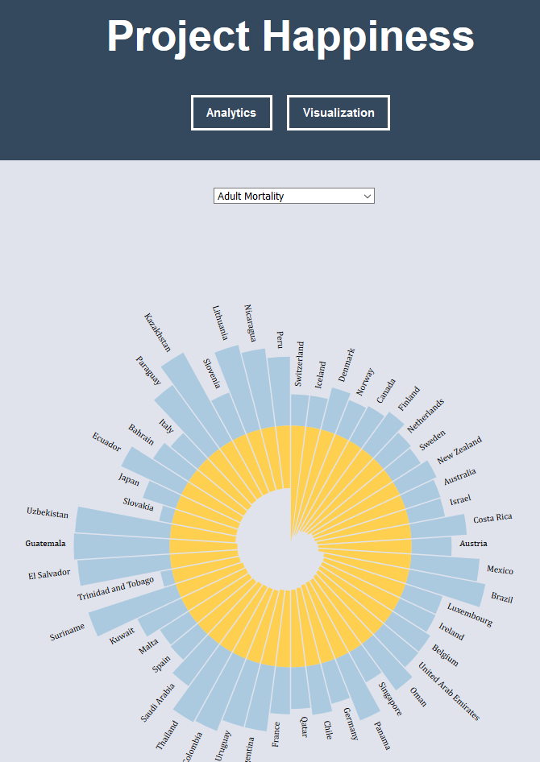
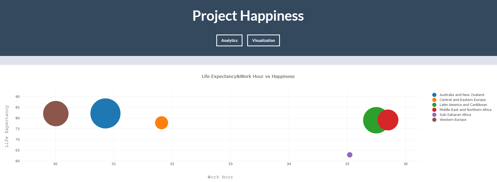
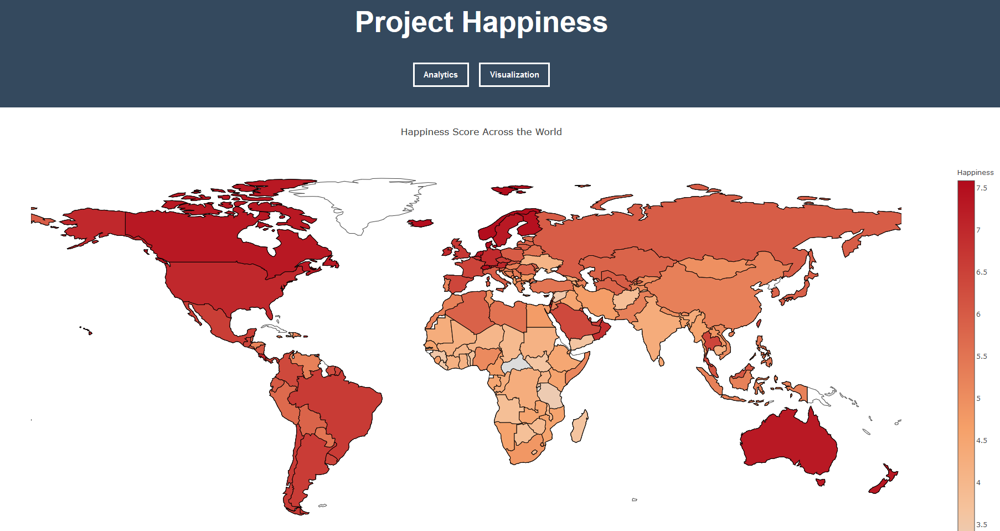

# Project Happiness

## Description  
1) Find factors that is related to happiness.  
2) Make interactive dashboard.  
3) Apply multivariable linear regression to model the relationships between the datasets and make happiness predictions.  
4) Utilize training & testing technique for model fitting.
5) Use Machine Learning to Classify Happiness through Images.

### Heroku App  
https://world-happiness-inc.herokuapp.com/

### How to run file
1) git clone https://github.com/xliu510/Happiness.git
1) open Import-export-clean-data.ipnyb in Jupyter notebook and run  
1) cd flask  
1) ./run.sh  
1) open browser and use the app generated http://127.0.0.1:5000/ link

### Landing Page  

### Visualization Page  

### JupyterNotebook Page  

### Radial Plot Page  

### Bubble Plot Page  

### Map Page 

# Happiness-Project
